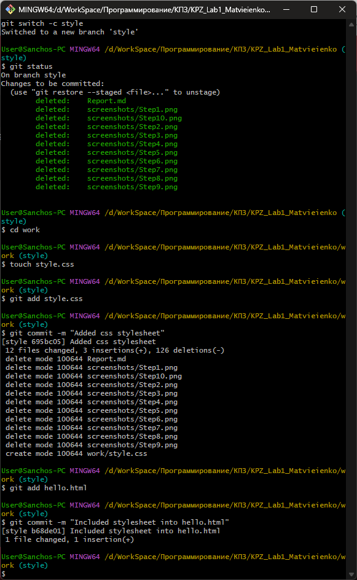
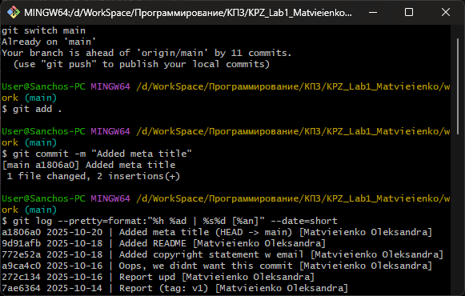
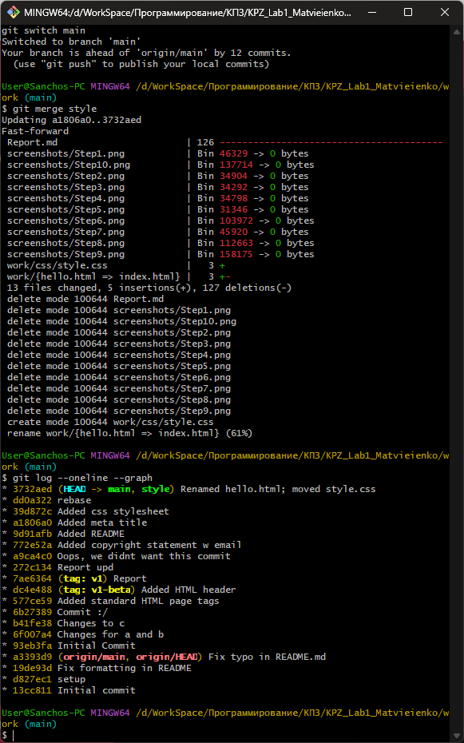
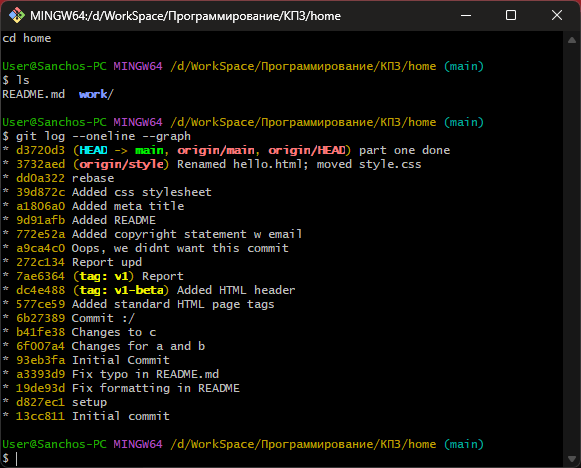
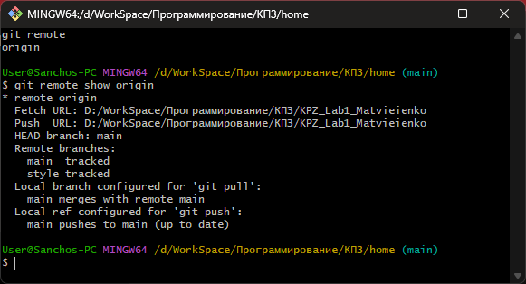

# Лабораторно-практична робота №1
**Дисципліна:** Конструювання програмного забезпечення  
**Тема:** Проходження інтерактивного курсу ["Git How To"](https://githowto.com/uk)  
**Мета:** Ознайомлення з базовими командами Git та формування практичних навичок роботи з системою контролю версій

---

## Виконання роботи

Під час виконання було повністю пройдено **42 кроків** курсу (2 частини) [Git How To](https://githowto.com/uk):

### Частина 1. Основи Git:

#### 1. Фінальні приготування
  
Повна готовність до роботи з Git. Встановлюємо ім'я та адресу електронної пошти, назву головної гілки та коректну обробку закінчень рядків

#### 2. Створення проєкту
  
Створення нового каталогу та ініціалізація репозиторію командою git init

#### 3. Перевірка стану
  
Команда git status, щоб дізнатися поточний стан репозиторія

#### 4. Внесення змін
  
Відстежування стану робочої директорії та її змін

#### 5. Індексація змін
  
Додавання файлів у staging area за допомогою git add .

#### 6. Індексація та коміт
  
Розділ великих змін на малі коміти

#### 7. Коміт змін
  
Коміти наступних оновлень з коментарями

#### 8. Зміни, а не файли
  
Git відстежує зміни, а не просто файли

#### 9. Історія проєкту
  
Перегляд історії комітів командою git log

#### 10. Отримання старих версій
  
Повернення робочої директорії до будь-якого попереднього стану та назад

#### 11. Створення тегів версій
  
Позначення важливих станів проєкту через git tag

#### 12. Скасування локальних змін (до індексації)
  
Повернення файлу до попереднього стану в цьому коміті через git restore

#### 13. Скасування проіндексованих змін (перед комітом)
  
Видалення зі staging area через git restore --staged

#### 14. Скасування комітів
  
Скасування коміту шляхом створення нового коміту, що скасовує небажані зміни через git revert

#### 15. Видалення комітів з гілки
  
Видалення останніх комітів з гілки через git reset

#### 16. Видалення тегу oops
  
Видалення тегів через git tag -d

#### 17. Внесення змін до останнього коміту (--amend)
  
Внесення змін та переіменування коміту з git commit --amend -m

#### 18. Створення гілки
  
Створення нової гілки командою git switch -c

#### 19. Перемикання гілок
  
Перемикання гілок через git switch

#### 20. Переміщення файлів
  
Перейменування або переміщення файлів за допомогою git mv

#### 21. Зміни в гілці main
  
Внесення нових змін у головну гілку (робота з декількома гілками)

#### 22. Перегляд розбіжних гілок
  
Порівняння гілок за допомогою git log --all --graph

#### 23. Злиття гілок
  
Об'єднання гілок командою git merge

#### 24. Створення конфлікту
  
Створення конфліктуючих змін в гілці

#### 25. Вирішення конфліктів
  
Ручне редагування файлів та завершення злиття після вирішення конфліктів

#### 26. rebase проти merge
Команда `merge` створює новий коміт злиття, зберігаючи структуру гілок, тоді як `rebase` переносить коміти однієї гілки поверх іншої, формуючи лінійну історію без додаткових злиттів  

**git merge**:
- Ідея: об'єднує дві гілки, зберігаючи їхню історію як є
- Результат: з'являється новий коміт злиття (merge commit), який має два батьки
- Історія: не змінюється, просто додається вузол, який поєднує зміни
- Безпечно для спільних гілок (main, master) — не переписує історію  

**git rebase**:
- Ідея: бере коміти з однієї гілки і переписує їх поверх іншої
- Результат: історія стає лінійною, без додаткових "злиттів"
- Історія: змінюється — старі коміти створюються наново
- Використовується для чистої історії (наприклад, перед push)

#### 27. Відкочування гілки style
  
Повернення гілки style до стану перед першим злиттям  

#### 28. Перебазування
  
Використання git rebase для вирівнювання історії

#### 29. Злиття в гілку main
  
Завершення роботи шляхом об'єднання всіх змін у головну гілку

### Частина 2. Декілька репозиторіїв:

#### 30. Клонування репозиторіїв
  
Копіювання існуючого репозиторію через git clone

#### 31. Перегляд клонованого репозиторія
  
Аналіз структури скопійованого репозиторію

#### 32. Що таке origin?
  
Ім'я за замовчуванням віддаленого репозиторія

#### 33. Віддалені гілки
  
Перегляд гілок, що існують на віддаленому сервері

#### 34. Зміна оригінального репозиторія
  
Внесли деякі зміни в оригінальний репозиторій

#### 35. Підтягування змін
  
Отримання оновлень через git fetch

#### 36. Злиття підтягнутих змін
  
Об'єднання отриманих оновлень

#### 37. Додавання гілки відстеження
  
Створення локальної гілки, що відстежує віддалену

#### 38. Чисті репозиторії
  
Створення пустого репозиторію через git clone --bare для спільної роботи

#### 39. Додавання віддаленого репозиторія
  
Додавання нового віддаленого джерела командою git remote add

#### 40. Відправка змін
  
Публікація локальних комітів через git push

#### 41. Підтягування спільних змін
  
Отримання та об'єднання змін з віддаленого репозиторію через git pull

---

## Висновки

Після проходження курсу я засвоїла:
- Основні принципи роботи системи контролю версій Git
- Механізм створення та переходу між гілками
- Як фіксувати зміни та відновлювати попередні версії файлів
- Як інтегрувати локальний репозиторій із віддаленим
- Як вирішувати конфлікти та працювати з тегами  

Робота допомогла краще зрозуміти логіку Git і навчила працювати з ним через консоль
